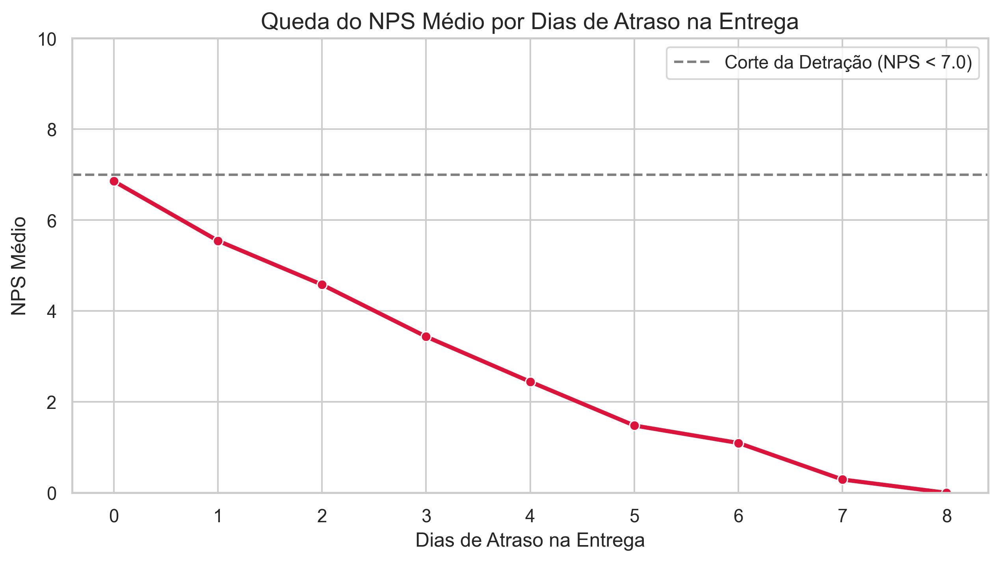

# 📊 Tech Challenge - Fase 1: NPS Preditivo em E-Commerce

Este repositório contém a solução do **Tech Challenge (Fase 1)**. O objetivo do projeto é conectar dados operacionais (O-Data) à satisfação do cliente (X-Data) para antecipar a insatisfação e o risco de detração no Net Promoter Score (NPS) antes mesmo da aplicação das pesquisas reativas.

---

## 📁 Estrutura do Repositório

```text
.
├── data/                  # Base de dados utilizada nas análises
├── notebooks/             # Notebooks Jupyter da EDA e dos Modelos Preditivos
│   ├── 01_eda.ipynb
│   └── 02_modelagem_nps.ipynb
├── reports/               # Relatórios executivos de entrega
│   ├── relatorio_executivo.md
│   └── figures/           # Gráficos e visualizações exportadas
├── README.md              # Documentação principal do repositório
└── requirements.txt       # Dependências e bibliotecas do projeto
```

---

## 🎯 Problema de Negócio & Fundamentação

No varejo digital, a pesquisa de NPS é coletada de forma reativa ao final da jornada de compra. Quando o cliente responde com uma nota baixa, a falha operacional já aconteceu.

- **Integração O-Data & X-Data:** Unimos variáveis de processo (atrasos, tempo de atendimento, reclamações) aos dados de percepção (NPS) para possibilitar uma atuação proativa.
- **Impacto na Retenção:** Conforme destacado na literatura de Customer Experience (_Reichheld & Sasser, 1990; Qualtrics, 2020_), pequenos aumentos na retenção de clientes reduzem custos de aquisição (CAC) e alavancam o _Lifetime Value_ (LTV).

---

## 📈 Principais Insights da Análise Exploratória (EDA)

1. **Volume de Detração:** **84,36%** da base analisada foi classificada como detratora (NPS < 7).
2. **Ponto de Ruptura na Logística:** Apenas **1 dia de atraso na entrega** causa uma queda drástica na nota média do NPS (de 6,85 para 5,54), consolidando a detração do cliente.
3. **Atrito Operacional:** Mesmo clientes sem atraso de entrega apresentam notas baixas quando expostos a múltiplos contatos com o SAC e alto tempo de resolução de chamados.



---

## 🤖 Modelos Preditivos Desenvolvidos

Foram implementados dois modelos para antecipar a percepção do consumidor a partir das variáveis de atrito operacional (`delivery_delay_days`, `complaints_count`, `customer_service_contacts`, `resolution_time_days`):

| Modelo                     | Objetivo                                              | Principais Métricas                             |
| :------------------------- | :---------------------------------------------------- | :---------------------------------------------- |
| **Regressão Linear (OLS)** | Predizer a nota exata do NPS (0 a 10)                 | **R²:** 0,556 \| **MAE:** 1,32 pontos           |
| **Regressão Logística**    | Classificar se o cliente será Detrator (1) ou Não (0) | **Acurácia:** 86% \| **Recall (Detrator):** 95% |

---

## 🛠️ Como Executar o Projeto

1. **Clonar o repositório:**
   ```bash
   git clone [https://github.com/henriquebrod/Tech-Challenge-Fase-1.git](https://github.com/henriquebrod/Tech-Challenge-Fase-1.git)
   cd Tech-Challenge-Fase-1
   ```
